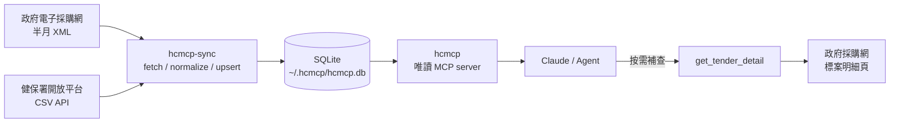

# healthcare-opendata-mcp 🏥

> 官方開放資料 → 可查詢 MCP 介面，讓 AI agent 不必直接處理分散的政府資料來源。

Self-hosted MCP server that syncs Taiwan government procurement (PCC) and National Health Insurance (NHI) open data into a local SQLite database, then exposes it through read-only MCP tools. A SELECT-only query guard (syntax allowlist plus a read-only SQLite authorizer) keeps the Twinkle-compatible `query_rows` interface safe for agent-driven querying.

[](https://github.com/trionnemesis/healthcare-opendata-mcp/actions/workflows/ci.yml)
[](https://www.python.org/)
[](https://github.com/jlowin/fastmcp)
[](LICENSE)

`healthcare-opendata-mcp`（命令名稱：`hcmcp`）是一個自建、可部署的 MCP server：把政府電子採購網與健保署開放資料同步到 SQLite，再以穩定的 MCP tools 提供給 Claude 或其他 agent 查詢。

專案保留 Twinkle Hub `query_rows` 的 SQL 式查詢模式，但資料來源、同步流程與儲存層都由本專案自行掌握，不依賴第三方聚合服務。

[GitHub Pages 導覽](https://trionnemesis.github.io/healthcare-opendata-mcp/) · [PCC 靜態資料看板](https://trionnemesis.github.io/healthcare-opendata-mcp/dashboard/) · [GitHub repository](https://github.com/trionnemesis/healthcare-opendata-mcp)

## Contents

- [Why](#why)
- [How it works](#how-it-works)
- [Static data dashboard](#static-data-dashboard)
- [Install](#install)
- [What it provides](#what-it-provides)
- [Querying](#querying)
- [Trust & security](#trust--security)
- [HTTP & GKE](#http--gke)
- [Development](#development)
- [Scope & limits](#scope--limits)
- [Related projects](#related-projects)
- [License](#license)

## Why

AI agent 要查政府資料時，真正的摩擦通常不在模型，而在資料入口：來源分散、格式不同、欄位缺漏，而且外部聚合服務的政策或可用性可能改變。

| Problem | What hcmcp does |
|---|---|
| 政府電子採購網與健保資料各自分散 | 以 `SourceAdapter` 統一 discover → fetch → normalize → upsert 流程 |
| 半月 XML、CSV API、標案明細頁格式不同 | 正規化成可查詢的 dataset 與 schema |
| 標案 open data 缺少截標、開標、預算 | 以 `get_tender_detail` 按需讀取官方明細頁補足資訊 |
| 第三方資料入口不可控 | 自行同步、儲存與提供 MCP 介面 |

## How it works



The project keeps ingestion and querying separate:

1. `hcmcp-sync` pulls official sources and writes the shared SQLite database.
2. `hcmcp` opens the same database in the query path and exposes MCP tools.
3. `list_datasets` → `get_dataset` → `query_rows` is the recommended discovery flow.
4. `get_tender_detail` performs an on-demand lookup when a tender needs deadline, opening time, or budget details.

## Static data dashboard

[GitHub Pages 資料看板](https://trionnemesis.github.io/healthcare-opendata-mcp/dashboard/) 是 SQLite 的可重建、唯讀 projection。它讀取 build-time 產生的 `docs/data/current.json`，提供 PCC 摘要、搜尋、公告類型／機關／日期篩選、日期／預算／決標金額排序與固定 20 筆分頁；現有 landing page 仍保留為專案導覽。

資料邊界：

- 「資料集概覽」矩陣由 catalog（已啟用者）與資料庫產生，**不硬編碼資料集名單**：啟用一個新資料集後，重新 export 即會出現在頁面上，不需要改 HTML、schema 或部署閘門。停用的候選不發布 —— 它們尚未實查，列出來會讓訪客誤以為已涵蓋。
- 矩陣中筆數顯示「—」代表該資料集**從未同步成功**（物化表尚未建立），與「同步成功但 0 筆」不同。
- 新鮮度**逐資料集**判定，門檻由 catalog 的 `update_cadence` 推導（**2 倍更新週期**）：每日更新的資料集停更 3 天就是過期，年度更新的資料集停更 3 天完全正常。顯示「無契約」代表該資料集未登錄更新頻率，**沒有判定依據**，不等於資料是最新的；這類資料集不會把整頁狀態拉成過期。判定基準是 `last_fetched_at`（per-dataset），不是 `ingestion_runs.finished_at`（per-source）—— 一個成功的 run 底下可能有某個資料集根本沒更新到。
- `generated_at` 是 UTC 快照產生時間；`status.source_max_date` 才是 PCC 官方資料中的最新日期。
- 狀態明確區分 `fresh`、`stale`、`degraded`、`empty`；JSON 無法載入或格式錯誤時，頁面顯示失敗而不呈現假成功。
- P0 只發布 allowlist 中的 PCC 欄位。NHI 僅顯示筆數與最後同步 metadata，不發布電話、地址或全院所目錄。
- 金額缺值維持 `null`，不轉為 0。完整 projection 先量測；超過 5 MiB 時只縮限明細列，仍保留全量聚合與明確的 export strategy。
- 這是隨 repository 提交的靜態快照，P0 尚未自動同步；完整、即時或任意條件查詢仍使用 MCP／SQLite。

從已成功同步的真實 DB 重建 snapshot 與預先渲染摘要：

```bash
.venv/bin/python scripts/export_board_data.py \
  --db /path/to/hcmcp.db \
  --out docs/data/current.json \
  --template scripts/templates/dashboard.html \
  --dashboard-out docs/dashboard/index.html

.venv/bin/python scripts/verify_dashboard.py --site docs
```

快照契約見 [`docs/data/schema-v1.json`](docs/data/schema-v1.json)，設計與 P0/P1/P2 邊界見 [`docs/superpowers/specs/2026-09-01-pages-dashboard-p0.md`](docs/superpowers/specs/2026-09-01-pages-dashboard-p0.md)；資料集矩陣改由 catalog 驅動的決策見 [`docs/superpowers/specs/2026-09-07-pages-catalog-driven-datasets.md`](docs/superpowers/specs/2026-09-07-pages-catalog-driven-datasets.md)，過期門檻的推導規則見 [`docs/superpowers/specs/2026-09-09-freshness-from-cadence.md`](docs/superpowers/specs/2026-09-09-freshness-from-cadence.md)。

## Install

```bash
git clone https://github.com/trionnemesis/healthcare-opendata-mcp.git
cd healthcare-opendata-mcp

python3.11 -m venv .venv
.venv/bin/python -m pip install -e .

# 建立或更新預設 DB：~/.hcmcp/hcmcp.db
.venv/bin/hcmcp-sync
```

加入 Claude Code：

```bash
claude mcp add hcmcp -- /absolute/path/to/healthcare-opendata-mcp/.venv/bin/hcmcp
```

### Sync options

```bash
.venv/bin/hcmcp-sync --db /path/to/hcmcp.db --tender-months 12 --award-months 12
```

| Flag | Default | Purpose |
|---|---|---|
| `--db` | `HCMCP_DB` 或 `~/.hcmcp/hcmcp.db` | 寫入的 SQLite 路徑 |
| `--tender-months` | `12` | 招標回溯月數（PCC 站上實際可回溯約 6 個月） |
| `--award-months` | `12` | 決標回溯月數 |

### Environment variables

| Variable | Default | Used by | Purpose |
|---|---|---|---|
| `HCMCP_DB` | `~/.hcmcp/hcmcp.db` | sync + server | SQLite 路徑；兩個 process 必須一致 |
| `HCMCP_TRANSPORT` | `stdio` | server | `stdio` / `http` / `sse`（僅相容既有部署） |
| `HCMCP_HOST` | `0.0.0.0` | server（http/sse） | 監聽位址；server 無 authentication，公開網段請改綁內網位址並在前方配置存取控制 |
| `HCMCP_PORT` | `8000` | server（http/sse） | 監聽 port |

`hcmcp-sync` 與 `hcmcp` server 共用同一個預設 DB：`~/.hcmcp/hcmcp.db`。如果要改路徑，兩個 process 都必須使用相同的 `HCMCP_DB`；sync 也可以使用 `--db`：

```bash
HCMCP_DB=/path/to/hcmcp.db .venv/bin/hcmcp-sync
HCMCP_DB=/path/to/hcmcp.db .venv/bin/hcmcp
```

否則可能出現「同步成功，但 server 查不到資料」的路徑漂移問題。server 啟動時若 DB 沒有任何資料集會直接以錯誤訊息結束，提醒先跑 `hcmcp-sync`。

## What it provides

### Datasets

目前 CLI 預設同步兩個資料集：

| Dataset | Scope | Official source | Update path |
|---|---|---|---|
| `pcc-tender` | 衛生福利部轄下機關的資訊勞務相關標案 | [政府電子採購網](https://web.pcc.gov.tw/) | 半月 XML；明細欄位按需 enrich |
| `nhi-clinic` | 健保特約醫事機構－診所 | [健保署資料開放平台](https://info.nhi.gov.tw/) | CSV API，每日更新 |

候選（catalog 中 `enabled=false`，**尚未同步**，待對官方端點實查後啟用）：

| Dataset | Scope | Official source | Update path |
|---|---|---|---|
| `nhi-healthcare-facility` | 部立／地方政府醫院、健保特約診所與衛生所 | [健保署資料開放平台](https://info.nhi.gov.tw/api/iode0000s01/Dataset?rId=A21030000I-D2100G-001) | CSV API，每日更新 |

### Dataset catalog

要同步哪些政府開放資料，由 [`src/health_opendata_mcp/catalog.py`](src/health_opendata_mcp/catalog.py) 這份宣告式目錄決定 —— 不是散落在程式流程裡。每筆 entry 除了 resource id／URL，還攜帶**出處與驗證狀態**：更新頻率、官方說明頁、`verified_at`（何時對官方端點實查過）、`verified_note`（實查當下觀察到的事實）與 `enabled`。

目錄在 import 時就會被驗證，違反即失敗（不靜默降級）：

- **驗證閘門** — `enabled=true` 必須有 `verified_at` 與 `verified_note`。未實查的候選可以留在目錄裡，但只能是 `enabled=false`；目錄有能力誠實表達「還沒驗證」。
- **官方網域白名單** — 下載與說明頁 URL 的 host 必須在 `OFFICIAL_HOSTS`。entry 是資料；不設限等於「新增一筆資料 = 新增一個對任意主機發請求的能力」。
- **欄位一致性與 `r_id` 字元集** — `r_id` 會被插值進 query string，限制字元集才能保證它不會挾帶 `&` / `?` 改寫 URL 的其他參數。

因此擴充資料範圍的流程是：

```text
1. 加一筆 CatalogEntry，enabled=False、verified_at=None
2. 對官方端點實查，把觀察到的事實寫進 verified_note，填上 verified_at
3. 改 enabled=True
```

目前目錄中的候選（**尚未實查，不會被同步**）：`nhi-hospital-district`（健保特約醫事機構－地區醫院）、`nhi-hospital-bed-ratio`（全民健保特約醫院之保險病床比率）。兩者的 `rId` 取自本 repository 既有測試，沒有實查日期紀錄，因此維持停用。

第 2 步的實查由 [`scripts/verify_catalog_sources.py`](scripts/verify_catalog_sources.py) 執行 —— 它只輸出可觀察的事實（HTTP status、列數、欄位名、natural key 是否存在與是否唯一），並產生可貼進 `catalog.py` 的 `verified_at` / `verified_note`：

```bash
.venv/bin/python scripts/verify_catalog_sources.py --only nhi-clinic
```

```text
[OK  ] nhi-clinic  (enabled=True)
       url: https://info.nhi.gov.tw/api/iode0000s01/Dataset?rId=A21030000I-D21004-009
       HTTP 200 · text/csv; charset=utf-8 · ... bytes · 24695 列 · 29 欄
       natural key 醫事機構代碼 · 相異 24695 · 無鍵列 0
       建議填入 catalog.py：
           verified_at="2026-09-07",
           verified_note="實查 2026-09-07:HTTP 200；...",
```

啟用一個資料集之後不需要再改別的地方：`hcmcp-sync` 會同步它，`list_datasets` 會列出它，重新 export 後 [資料看板](https://trionnemesis.github.io/healthcare-opendata-mcp/dashboard/) 的資料集矩陣也會出現它。

該 script **只讀**：不會修改 `catalog.py`，也不會翻 `enabled`；啟用仍是人工 review 後的 PR 編輯。`--enabled-only` 可作為上游漂移檢查（欄位或 natural key 不再成立時離開碼非零）。若本機不便連外，可用 GitHub Actions 的 `Verify catalog sources` workflow 手動觸發（`workflow_dispatch`，未排程）。

### MCP tools

| Tool | Purpose |
|---|---|
| `list_sources` | 列出資料來源、取得策略與最後抓取時間 |
| `list_datasets` | 列出可查詢資料集、欄位與新鮮度（`last_fetched_at` / `row_count`） |
| `get_dataset` | 取得 dataset metadata、schema、新鮮度與可選的抽樣資料列 |
| `query_rows` | 對單一 dataset 做 SELECT-only 篩選、排序與聚合 |
| `search_records` | 跨資料集關鍵字搜尋 |
| `get_record` | 以 `(dataset_id, natural_key)` 取得單筆完整資料 |
| `get_vendor_stats` | 依得標次數與金額整理廠商排名 |
| `get_tender_detail` | 即時取得標案明細的截標、開標、預算與採購屬性 |

## Querying

先看資料集與 schema，再執行查詢：

```python
list_datasets()
get_dataset(dataset_id="pcc-tender", sample_rows=5)
```

兩者都會回 `last_fetched_at` 與 `row_count`，因此不需要額外查詢就能判斷資料是否過期。`row_count` 為 `null` 代表該資料集**從未同步成功**（物化表尚未建立），與「同步成功但 0 筆」不同 —— 缺值不會被折成 0。

`query_rows` 保留 Twinkle 相容的 SQL-style 查詢介面，支援欄位選取、`WHERE`、`GROUP BY`、排序與聚合：

```python
query_rows(
    dataset_id="pcc-tender",
    columns=[
        "agency",
        "COUNT(*) AS n",
        "SUM(CAST(award_price AS INTEGER)) AS total",
    ],
    where="announcement_type='決標公告' AND date >= '2025-01-01'",
    group_by=["agency"],
    order_by="total DESC",
    limit=50,
)

# nhi-healthcare-facility 目前為候選（catalog enabled=false），啟用後才有資料
query_rows(
    dataset_id="nhi-healthcare-facility",
    columns=[
        "醫事機構代碼",
        "醫事機構名稱",
        "facility_type",
        "governing_level",
        "classification_source",
        "is_active",
    ],
    where=(
        "facility_type='hospital' AND governing_level='mohw' "
        "AND is_active=1"
    ),
    order_by="醫事機構名稱",
    limit=50,
)
```

SQLite 使用 `LIKE`，不使用 PostgreSQL 的 `ILIKE`；金額欄位需要依資料內容使用 `CAST(... AS INTEGER)`。

## Trust & security

`query_rows` 接受 SQL 片段，因此實作了兩層防禦：

- **語法層**：只允許單一 `SELECT`；拒絕多語句、註解、`PRAGMA`、`ATTACH`、DML、DDL 與危險 keyword，並將 limit 硬上限設為 400。
- **執行層**：使用 SQLite read-only connection 與 authorizer allowlist，只允許讀取單一物化資料表；另有 VM 步數上限。

寫入路徑（sync）另有一層 ingestion 防禦：PCC 半月 XML 一律以 `defusedxml` 解析，DTD 與 entity 在 parser 層就被拒絕（CWE-611/776，不使用可被 padding 繞過的字串前綴檢查），並保留 20M 字元的輸入上限。

這是查詢執行安全邊界，不是使用者認證層。MCP server 本身沒有 authentication；HTTP/GKE 部署應放在內部網路，或在前方配置 IAP、service mesh mTLS 等存取控制。

## HTTP & GKE

本機或容器可使用 MCP streamable HTTP：

```bash
HCMCP_TRANSPORT=http HCMCP_PORT=8000 .venv/bin/hcmcp

curl http://localhost:8000/healthz
# {"status":"ok"}

claude mcp add --transport http hcmcp http://<host>:8000/mcp
```

`HCMCP_TRANSPORT=sse` 僅保留給既有部署相容；新網路部署使用 `http`。預設監聽 `0.0.0.0:8000`，容器外執行時可用 `HCMCP_HOST` 收斂綁定位址。

GKE 架構、Workload Identity、CronJob、GCS DB artifact 與 Kubernetes manifests 請見 [deploy/README.md](deploy/README.md)。DB 以不可變唯讀 artifact 形式從 GCS 拉進各 pod 的 emptyDir，因此 replica 可自由水平擴展；manifests 依 Pod Security Standards *restricted* 設定 `runAsNonRoot`、`allowPrivilegeEscalation: false`、`capabilities.drop: ["ALL"]` 與 seccomp `RuntimeDefault`。

## Development

```bash
.venv/bin/python -m pip install -e ".[dev]"
.venv/bin/python -m pytest
.venv/bin/python -m bandit -r src -ll        # SAST，與 CI 同門檻（Medium 以上失敗）
.venv/bin/python -m pip_audit --skip-editable # 依賴弱點掃描
```

CI（`.github/workflows/ci.yml`）在 push 與 pull request 跑相同三項：pytest（Python 3.11 / 3.12）、bandit、pip-audit。另有 `verify-catalog.yml`，僅手動觸發（`workflow_dispatch`），用於對官方端點實查；刻意未排程，避免對官方來源產生持續性流量。

主要程式分層如下：

```text
src/health_opendata_mcp/
├── catalog.py     資料集目錄：要同步哪些開放資料（含出處與驗證閘門）
├── adapters/      官方來源 adapter 與 HTTP/CSV/PCC parser
├── domain/        query_guard 等純函式安全規則
├── ingestion/     discover → fetch → normalize → upsert pipeline
├── repository/    SQLite schema、物化表與唯讀 query executor
└── mcp_server/    FastMCP tools、transport 與 QueryService
```

新增資料集是在 `catalog.py` 加一筆 `CatalogEntry`（見上方 [Dataset catalog](#dataset-catalog)），不必改 `cli.py`；`cli.py` 的 `build_adapters()` 只依目錄中 `enabled` 的 entry 組裝 adapter，某一種 adapter 沒有啟用項目時就不建立。新增**資料來源**（新的取得策略）才需要實作 `SourceAdapter` 的 `discover`、`fetch`、`normalize`。標案的資訊勞務主題篩選由 `cli.py` 的 `IT_INCLUDE` / `IT_EXCLUDE` 關鍵字決定。

行為契約以 Gherkin 記錄在 `spec/features/`（ingestion、query-rows、query-tools、source-registration、headless-fallback），資料模型見 `spec/erm.dbml`。

### Maintenance scripts

| Script | Purpose |
|---|---|
| `scripts/enrich_bid_deadline.py` | 對近期、IT 類、尚未 enrich 且尚未決標的招標公告逐案補截標/開標/預算（限量 `--limit` + 節流 `--throttle`，被封鎖即停） |
| `scripts/export_board_data.py` | 從真實 SQLite 原子匯出 versioned `current.json` 與預渲染看板摘要；超過 5 MiB 時縮限明細 |
| `scripts/verify_dashboard.py` | 在 Pages 上傳前驗證 snapshot schema、大小、安全 DOM 路徑、連結與 artifact 邊界 |
| `scripts/prune_local_db.py` | 清除超出目前同步範圍的舊資料（預設 dry-run，`--apply` 才寫入） |
| `scripts/verify_catalog_sources.py` | 對 catalog 的官方端點實查，輸出 `verified_at` / `verified_note` 素材與上游漂移檢查（只讀，不改 `catalog.py`） |

`enrich_bid_deadline.py` 的候選條件為：`announcement_type='招標公告'`、`date` 在區間內、`bid_deadline` 為空、標題屬 IT 類，且同 `job_number` 尚無決標公告。決標與招標是兩筆獨立 record，只看招標那筆看不出案子已結束，因此另行比對決標的 `job_number` 集合，避免已決標的舊案佔用有限的明細頁請求額度、排擠仍可投標的新案。

## Scope & limits

- 預設同步範圍刻意收斂為衛福部資訊勞務相關標案與健保診所，不是完整的政府採購或醫療資料目錄。
- `catalog.py` 中 `enabled=false` 的候選資料集尚未對官方端點實查，不會被同步，也不應被視為已支援的資料範圍。
- `get_tender_detail` 依賴政府電子採購網即時明細頁；舊案下架、網站維護或限流時，工具可能回傳錯誤，應稍後重試。
- GitHub Pages 看板是提交時的靜態 snapshot，不等於 MCP／SQLite 即時查詢；自動同步與 last-known-good 發布屬後續 P1。
- HTTP server 預設沒有 authentication；公開暴露前必須自行配置網路層存取控制。
- `nhi-healthcare-facility` 目前在 catalog 中為 `enabled=false`：adapter 與分類規則已併入且有測試覆蓋，但尚未對官方端點實查，因此不會被同步。啟用方式見下方 Development。
- 啟用後 `nhi-clinic` 與 `nhi-healthcare-facility` 會有資料重疊（例如診所），這是正常行為；兩者各自保留原有用途。
- `nhi-healthcare-facility` 僅納入 `特約類別` 1~3 且 `權屬別名稱` 在「部立及直轄市立醫院」與「縣市立醫院」，以及 `特約類別` 4（診所／衛生所）。
- `governing_level` 的 `mohw` 由衛福部官方名冊與 NHI exact-name mapping 決定；衛生所與其餘市／縣立醫院標為 `local_government`，私人診所等無可靠主管層級者為 `unknown`。
- 資料依官方來源更新節奏而變動；repository 只提交經欄位 allowlist、大小門檻與驗證的 Pages snapshot，不提交 SQLite 或原始同步資料。

## Related projects

[g0VMCP](https://github.com/trionnemesis/g0VMCP) — 衛福部標案的生命週期與明細加值 MCP，處理招標 → 更正 → 決標狀態與深度標案情報。兩個專案刻意零耦合：本專案提供 Twinkle 相容的扁平列查詢，g0VMCP 提供深度標案資訊；PCC XML parser 以純函式方式 vendored 自 g0VMCP。

[opendataCampus-MCP](https://github.com/trionnemesis/opendataCampus-MCP) — 教育資源導航 MCP，以 TWCampus 為目錄入口路由至台灣官方教育平台。與本專案同屬「官方開放資料 → 可查詢 MCP 介面」系列，但服務網域為教育資源而非採購／健保。

## License

[MIT](./LICENSE) — 資料依[政府資料開放授權條款](https://data.gov.tw/license)使用。
